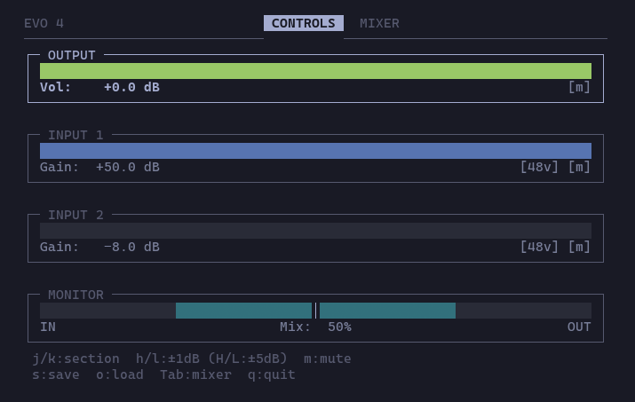
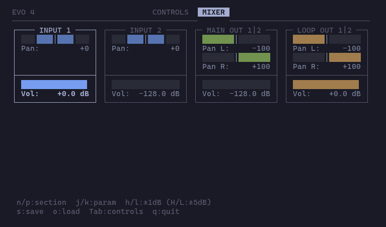

# audient-evo-py

Audient EVO (4/8) Linux controller.

Audient software is Win/macOS only. CLI `evoctl` and TUI `evotui` implement the same controls for Linux while without interrupting audio streaming (other attempts at this required driver swapping).

**How?** A small kernel module (`evo_raw`) binds to the EVO's unused DFU interface to obtain device handle, allowing it to coexist with `snd-usb-audio`.

| Controls | Loopback Mixer |
|----------|----------------|
|  |  |

## Supported Devices

| | EVO 4 | EVO 8 (needs testing)|
|---|---|---|
| Inputs | 2 | 4 |
| Output pairs | 1 (OUT 1/2) | 2 (OUT 1/2, OUT 3/4) |
| Gain range | -8 to +50 dB | 0 to +58 dB |
| Direct monitor | Yes (EU56 blend) | Via mixer |
| Mixer matrix | 6x2 | 10x4 |
| Device node | `/dev/evo4` | `/dev/evo8` |

## Requirements

- Linux with `snd-usb-audio` (standard kernel audio)
- Kernel headers (`linux-headers` package) and `make` - for building the kernel module
- DKMS - optional but recommended; without it the module will stop loading after a kernel update and must be reinstalled (re-running the install script suffices - no source changes needed)
- User in the `dialout` group - for device access without sudo (the install script can do this)
- Python 3.10+ - the only runtime dependency; `pipx` is recommended for install

### Testing

Python dependencies:
- `pytest` to run `tests/`.
- `sounddevice` for audio simulation
- `numpy` for sound generation

## Install

### Kernel module

Installs via DKMS, adds a udev rule, and loads the module. The install script prompts for which device to configure.

*For `systemd service` that auto-loads default config on system start or device replug, install `evoctl` locally using pipx (or adjust the evo*-load-config.service as needed).

```bash
cd kmod
sudo ./install.sh
```

### evoctl / evotui

No external Python dependencies. Runs directly from the repo:

```bash
python evoctl.py set volume -20
python -m tui
```

Or install `evoctl` & `evotui` commands with `pipx`:

```bash
pipx install .
```

### WirePlumber config (optional, recommended)

EVO devices expose extra USB audio channels (loopback bus) that PipeWire treats as surround without configuration. The install script prompts for your device and sets up:

- Stereo-only output (disables upmix to loopback channels)
- Virtual sinks/sources for loopback routing
- Idle suspension disabled (prevents clicks on stream start)
- Default sink/source at login

```bash
bash wireplumber/install.sh
```

See [wireplumber/README.md](wireplumber/README.md) for signal flow diagrams and details.

## Uninstall

```bash
# Kernel module
sudo ./kmod/uninstall.sh

# Wireplumber config
./wireplumber/uninstall.sh

# evoctl & evotui
pipx uninstall audient-evo-py
```

## Usage

```bash
# Volume (both devices)
evoctl set volume -20
evoctl get volume

# EVO 8: second output pair
evoctl set volume -20 -t output2
evoctl get volume -t output2

# Input gain (per-channel)
evoctl set gain 50 -t input1
evoctl set gain 30 -t input3   # EVO 8: inputs 3-4

# Mute
evoctl set mute 1 -t output    # EVO 4: single output
evoctl set mute 1 -t output2   # EVO 8: second output pair

# Phantom power
evoctl set phantom 1 -t input1

# Monitor mix (EVO 4 only)
evoctl set monitor 50           # 0=input only, 100=playback only

# Loopback mixer
evoctl mixer input1 --volume -6 --pan 0
evoctl mixer output --volume -6 --pan-l -100 --pan-r 100
evoctl mixer loopback --volume -128
evoctl mixer input1 --volume -6 --pan 0 --mix-bus 1  # EVO 8: second mix bus

# Status / config
evoctl status
evoctl status -f json
evoctl save
evoctl load

# Diagnostics (works without device connected)
evoctl diag

# Device selection (when multiple connected)
evoctl --device evo8 set volume -20

# TUI
python -m tui
# or just
evotui           # after pipx install
```

Mixer settings are write-only; changes are auto-saved to `~/.config/audient-evo-py/{evo4,evo8}/.mixer-state.json`. Device controls can be saved/loaded via CLI or TUI.

## Diagnostics

`evoctl diag` collects system, USB, kernel module, audio stack, and device info as JSON. Useful for debugging:

```bash
evoctl diag > diag.json
```

## Components

| Component | Description |
|-----------|-------------|
| `kmod/` | Out-of-tree kernel module (`evo_raw.c`), exposes `/dev/evo*` |
| `evo/` | Backend - device specs, kmod wrapper, controller, config tools |
| `tui/` | Terminal UI using curses |
| `wireplumber/` | PipeWire + WirePlumber config for correct channel mapping |

See [DESIGN.md](dev/DESIGN.md) for architecture, protocol, and USB entity details.

## Related Projects

Partially working, quirky, other platforms, ... - very helpful nonetheless.

- [subsubl/Evo4mixer](https://github.com/subsubl/Evo4mixer)
- [vijay-prema/audient-evo-linux-tools](https://github.com/vijay-prema/audient-evo-linux-tools/tree/main)
- [soerenbnoergaard/evoctl](https://github.com/soerenbnoergaard/evoctl)
- [TheOnlyJoey/MixiD](https://github.com/TheOnlyJoey/MixiD)
- [charlesmulder/alsa-audient-id14](https://github.com/charlesmulder/alsa-audient-id14)
- [r00tman/mymixer](https://github.com/r00tman/mymixer)
- [hoskere/audient-evo8-rp2350](https://github.com/hoskere/audient-evo8-rp2350-arduino/tree/main)

## Notice

EVO 4 is fully tested. EVO 8 needs testing with hardware (I do not own one) - see [docs/EVO8-TESTING.md](docs/EVO8-TESTING.md) if you can help.

If you own Audient EVO device and are willing to cooperate, you're welcome to open an issue.

## License

Public domain. Free for all. Give credit as you see fit :-). See [LICENSE](LICENSE).
